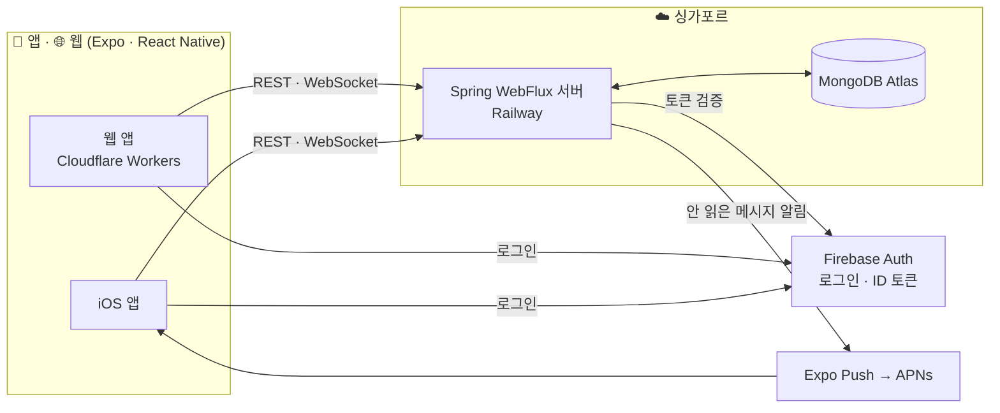

<div align="center">

# 🥚 puny-chat

[English](README.md) · **한국어**

**좋아하는 사람과 대화하며, 작은 Buddy를 함께 키워요.**

*Chat with someone you like, and raise a tiny buddy together.*

**[👀 로그인 없이 구경하기](https://puny-chat.com/demo)** · [웹에서 시작하기](https://puny-chat.com) · [제품 문서](docs/product.md) · [서버 설계](docs/server-design.md)

<br>


<sub>구경하기: 55초 동안 알이 어른이 될 때까지</sub>

</div>

<br>

## 이런 앱이에요

puny-chat은 **딱 두 사람을 위한 메신저**예요. 그리고 두 사람 사이에는 작은 생명체 하나가 살고 있어요.

```text
18:02   버디가 💩을 쌌어요

Yuki    헐 버디 똥 쌌어 ㅋㅋㅋ
Henry   ㅋㅋㅋ 니가 치워
Yuki    싫어 ㅋㅋ
```

"오늘 뭐 먹었어?"로 시작한 평범한 대화 사이에 Buddy가 가끔 사건을 만들어요. 배가 고파지고, 💩을 싸고,
둘이 이야기를 많이 할수록 조금씩 자라요. 억지로 대화거리를 던져주는 AI도, 매일 해야 하는 미션도 없어요.
그냥 **같이 키우는 게 하나 있다**는 것만으로 대화가 조금 더 즐거워지는 앱이에요.

> **Chat first. Buddy makes it fun.** 채팅이 주인공이고, Buddy는 곁에서 거드는 작은 친구예요.

<br>

<div align="center">
<table>
  <tr>
    <td align="center"><br><sub><b>혼자 시작해요</b><br>알이 태어나면 바로 채팅 화면</sub></td>
    <td align="center"><br><sub><b>친구 한 명을 초대해요</b><br>8자리 코드, 한 번만 사용</sub></td>
    <td align="center"><br><sub><b>대화하며 함께 돌봐요</b><br>입력 중 · 읽음 · 접속 표시</sub></td>
    <td align="center"><br><sub><b>Buddy를 챙겨요</b><br>밥주기 · 청소하기</sub></td>
  </tr>
</table>
</div>

<br>

## 할 수 있는 것

**💬 채팅**
- 1:1 실시간 메시지. 끊겨도 다시 연결되면 놓친 메시지를 채우고, 보내지 못한 메시지는 **한 번만** 전달돼요
- 상대 접속 표시, 입력 중, 읽음
- 앱을 닫아두면 새 메시지를 푸시로 알려줘요 (iOS, 홈 화면에 추가한 웹)

**🐣 Buddy**
- 채팅 위 작은 무대에서 도트 Buddy가 돌아다녀요. 밥을 주면 냠냠 먹고, 상대 메시지가 오면 폴짝 뛰어요
- 알 → 아기 → 어린이 → 어른으로 자라요. 대화하고 돌봐줄수록 빨리요
- 시간이 지나면 배고파지고 💩을 싸요. 밥그릇·💩을 누르거나 채팅에 "밥"만 보내도 돌볼 수 있고, 누가 챙겼는지 대화에 남아요
- 혼자 두면 춤추고 노래해요. 어린이가 되면 "오랜만이야!", "밥 먹었어?"처럼 말도 걸어요
- **죽지 않아요.** 며칠 잊어도 괜찮아요. 돌봐주면 금방 기운을 차려요

**🤝 둘이서**
- 같은 날 둘 다 메시지를 보내면 하루 한 번 **함께 보너스** 🤝. 혼자보다 둘이 이야기할 때 더 잘 자라요
- 가입 없이 **바로 시작**해요. 이름만 정하면 끝. 나중에 Google 계정을 연결하면 그대로 이어져요
- 혼자 와도 괜찮아요. **먼저 구경하기**를 누르면 알이 어른이 될 때까지의 55초짜리 방을 볼 수 있어요
- 혼자 시작해도 되고, 언제든 친구 한 명을 초대할 수 있어요. 키우던 Buddy는 그대로 이어져요
- 한 방에는 최대 두 명. 둘만의 공간이에요

**🌏 어디서나**
- iPhone이 기준이고, 같은 앱이 웹에서도 그대로 돌아가요
- 한국어 · 日本語 · English, 라이트 · 다크 모드

<div align="center">
<table>
  <tr>
    <td align="center"><br><sub>다크 모드</sub></td>
    <td align="center"><br><sub>웹 (데스크톱)</sub></td>
  </tr>
</table>
</div>

<br>

## 아키텍처



| 영역 | 사용한 것 |
| --- | --- |
| 앱 | Expo (React Native), TypeScript, Expo Router — iOS와 웹을 한 코드로 |
| 서버 | Java 25, Spring Boot 4, WebFlux (reactive), WebSocket |
| 데이터 | MongoDB Atlas, 트랜잭션 없이 조건부 업데이트와 unique 인덱스로 동시성 처리 |
| 인증 · 푸시 | Firebase Authentication, Expo 푸시 서비스, Web Push |
| 인프라 | Railway · MongoDB Atlas · Cloudflare Workers, Terraform (state는 R2), GitHub Actions |

작은 서비스에 맞게 **작게** 만들었어요. 서버 한 대가 실시간 연결을 모두 들고 있어서 Redis 같은 중간 저장소가 없고,
Buddy의 배고픔과 💩은 스케줄러 없이 **볼 때 계산**해요. 자세한 결정과 이유는 [서버 설계](docs/server-design.md)에 있어요.

<br>

## 저장소 구조

```text
app/      Expo 앱 (iOS · 웹)
server/   Spring WebFlux 서버
infra/    Terraform (Railway · Atlas · Cloudflare)
docs/     제품 · 서버 설계 문서
```

## 로컬에서 실행하기

```bash
# 서버 (Docker로 MongoDB가 같이 떠요) → http://localhost:8080
cd server && ./gradlew bootRun

# 앱 (웹) → http://localhost:8081
cd app && cp .env.example .env.local   # Firebase 웹 설정을 채워요
pnpm install && pnpm web
```

iPhone에서는 개발용 빌드로 열어요. 자세한 명령은 [CLAUDE.md](CLAUDE.md)에 정리돼 있어요.

<br>

## 지금 어디쯤

- [x] 게스트로 바로 시작, 계정 연결(웹 Google), 방 만들기 · 초대 · 나가기
- [x] 실시간 채팅 (재연결, 중복 없는 전송, 입력 중 · 읽음 · 접속 표시)
- [x] Buddy 돌봄과 성장, 둘이 함께 보너스
- [x] 배포 (서버 Railway · 웹 Cloudflare Workers · DB Atlas)
- [x] Buddy 도트 캐릭터와 애니메이션 (먹기 · 💩 · 진화 · 메시지 반응)
- [x] 웹 푸시 (홈 화면에 추가한 웹)
- [ ] iPhone 개발용 빌드와 푸시 알림
- [ ] Sign in with Apple

## 라이선스

[MIT](LICENSE). 코드는 자유롭게 쓸 수 있고, 쓸 때는 저작권 표시와 라이선스 문구를 함께 남겨 주세요.
