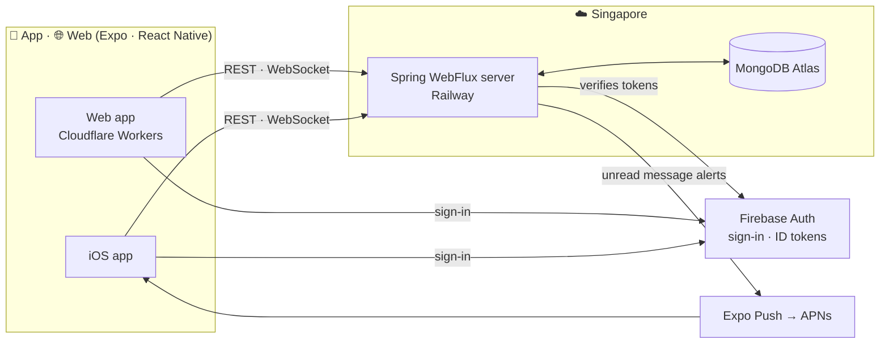

<div align="center">

# 🥚 puny-chat

**English** · [한국어](README-kr.md)

**Chat with someone you like, and raise a tiny buddy together.**

**[👀 Take a look, no sign-up](https://puny-chat.com/demo)** · [Start on the web](https://puny-chat.com) · [Product doc](docs/product.md) · [Server design](docs/server-design.md)

<br>


<sub>The tour: from egg to adult in 55 seconds</sub>

</div>

<br>

## What it is

puny-chat is a **messenger for exactly two people**. And between those two lives one small creature.

```text
18:02   Buddy pooped 💩

Yuki    lol buddy pooped
Henry   lol you clean it
Yuki    nope lol
```

In the middle of an ordinary "what did you eat today?" conversation, the Buddy now and then makes something happen.
It gets hungry, it poops, and the more the two of you talk, the more it grows. No AI throwing conversation starters
at you, no daily missions. Just **having something to raise together** makes the chat a little more fun.

> **Chat first. Buddy makes it fun.** The chat is the main character; the Buddy is a small friend on the side.

<br>

<div align="center">
<table>
  <tr>
    <td align="center"><br><sub><b>Start on your own</b><br>The egg hatches, straight into the chat</sub></td>
    <td align="center"><br><sub><b>Invite one friend</b><br>8-character code, single use</sub></td>
    <td align="center"><br><sub><b>Chat and care together</b><br>Typing · read · online</sub></td>
    <td align="center"><br><sub><b>Look after the Buddy</b><br>Feed · clean up</sub></td>
  </tr>
</table>
</div>

<br>

## What you can do

**💬 Chat**
- 1:1 real-time messages. After a dropped connection, missed messages fill in, and unsent ones are delivered **exactly once**
- Online status, typing, read receipts
- New messages arrive as push notifications while the app is closed (iOS, and the web added to the home screen)

**🐣 Buddy**
- A pixel Buddy wanders a small stage above the chat. Feed it and it munches; a message from your partner makes it hop
- It grows from egg → baby → child → adult. The more you talk and care for it, the faster
- Over time it gets hungry and poops. Tap the bowl or the 💩, or just send "food" in the chat, and the chat notes who did it
- Left alone it dances and sings. Once a child, it talks too: "Long time no see!", "Have you eaten?"
- **It never dies.** Forget it for a few days and it's fine; a little care and it's back on its feet

**🤝 For two**
- When you both send a message on the same day, a **together bonus** 🤝 once a day. It grows better when you two talk
- **Start right away**, no sign-up: just pick a name. Link a Google account later and everything carries over
- Came alone? **Take a look first** plays a 55-second room where the egg grows into an adult
- Start on your own and invite one friend any time; the Buddy you've been raising stays
- At most two people per room. A space just for you two

**🌏 Anywhere**
- Built for iPhone first, and the same app runs on the web
- 한국어 · 日本語 · English, light and dark mode

<div align="center">
<table>
  <tr>
    <td align="center"><br><sub>Dark mode</sub></td>
    <td align="center"><br><sub>Web (desktop)</sub></td>
  </tr>
</table>
</div>

<br>

## Architecture



| Area | Built with |
| --- | --- |
| App | Expo (React Native), TypeScript, Expo Router — iOS and web from one codebase |
| Server | Java 25, Spring Boot 4, WebFlux (reactive), WebSocket |
| Data | MongoDB Atlas; concurrency through conditional updates and unique indexes, no transactions |
| Auth · Push | Firebase Authentication, Expo push service, Web Push |
| Infra | Railway · MongoDB Atlas · Cloudflare Workers, Terraform (state in R2), GitHub Actions |

Built **small**, to fit a small service. One server holds every real-time connection, so there is no Redis or other
broker in between, and the Buddy's hunger and 💩 are **computed when looked at**, with no scheduler. The decisions
and the reasons behind them are in the [server design](docs/server-design.md) (Korean).

<br>

## Repository layout

```text
app/      Expo app (iOS · web)
server/   Spring WebFlux server
infra/    Terraform (Railway · Atlas · Cloudflare)
docs/     Product and server design docs (Korean)
```

## Running locally

```bash
# Server (MongoDB starts with it in Docker) → http://localhost:8080
cd server && ./gradlew bootRun

# App (web) → http://localhost:8081
cd app && cp .env.example .env.local   # fill in the Firebase web config
pnpm install && pnpm web
```

On an iPhone, open it with a development build. The commands are collected in [CLAUDE.md](CLAUDE.md) (Korean).

<br>

## Where it stands

- [x] Start right away as a guest, link an account (Google on the web), create · invite · leave a room
- [x] Real-time chat (reconnecting, exactly-once sending, typing · read · online)
- [x] Buddy care and growth, the together bonus
- [x] Deployment (server on Railway · web on Cloudflare Workers · DB on Atlas)
- [x] Buddy pixel character and animations (eating · 💩 · evolving · reacting to messages)
- [x] Web Push (the web added to the home screen)
- [ ] iPhone development build and push notifications
- [ ] Sign in with Apple

## License

[MIT](LICENSE). Use the code freely; keep the copyright notice and license text with it.
