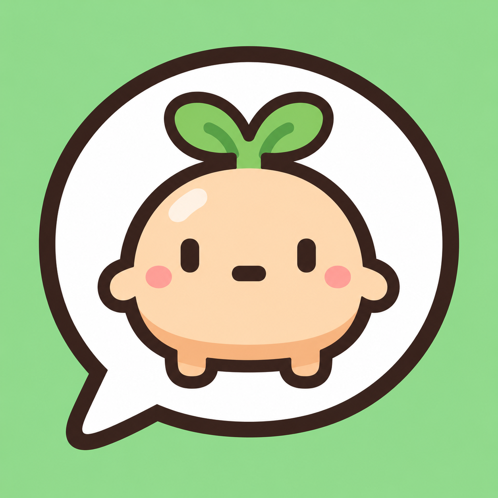
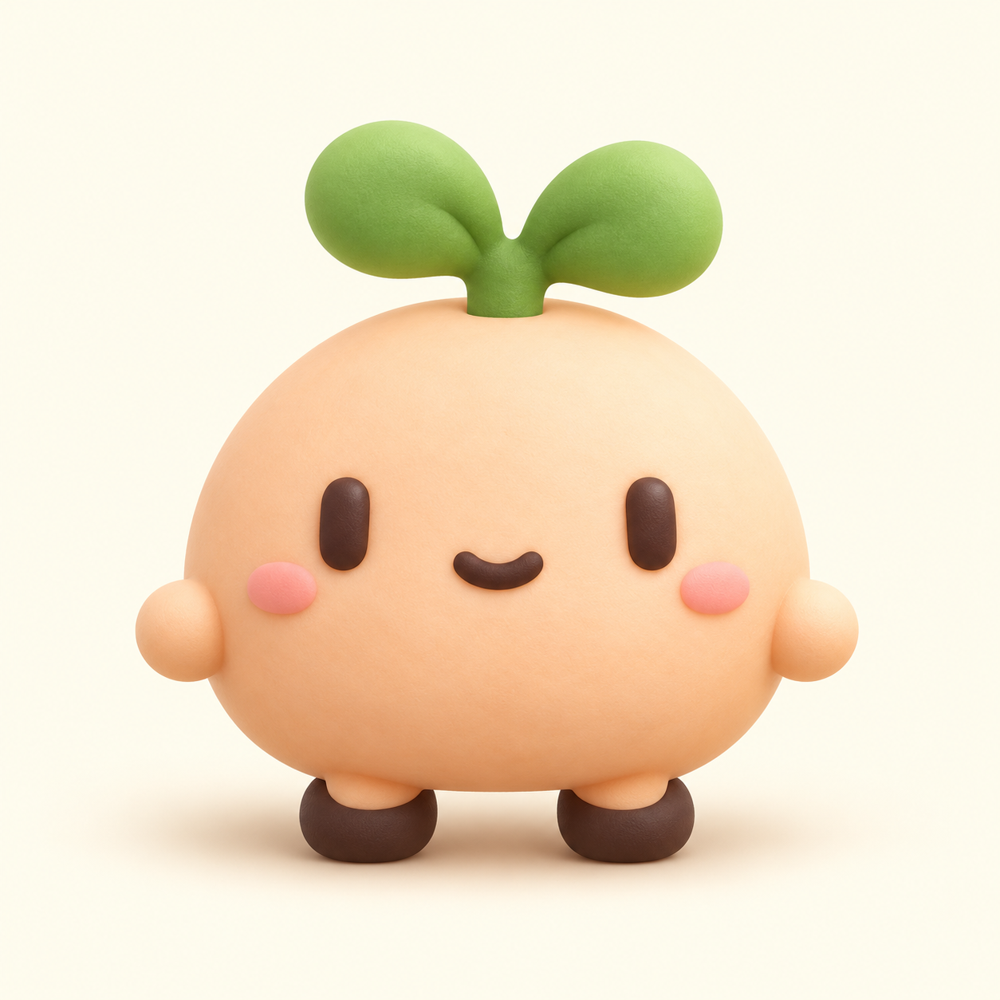

# puny-chat 앱 아이콘 후보

2026-10-10. 내장 ImageGen으로 생성한 비교용 시안 6종. 사용자가 2번 크림색 일러스트를 선택했다.
기존 `app/assets/images/icon.png`는 캐릭터 정체성 참고 이미지로 사용했다.
선택한 원본과 파생 원본은 `app/assets/brand/`에 보관하며, `pnpm icons`로 플랫폼별
크기·투명도·안전 영역에 맞춰 내보낸다. 상세 설명은 `app/assets/README.md`에 있다.

## 1. 도트 · 민트


생성 프롬프트:

```text
Use case: logo-brand. Asset type: one standalone square mobile app icon design exploration for puny-chat, a tiny 1:1 messenger with a shared virtual pet. Input image 1 is ONLY a character identity reference, not an edit target. Create a NEW original icon in the following direction: Crisp deliberately drawn pixel art, large chunky square pixels, faithful to the reference mascot proportions and facial arrangement. Solid pale mint green background. Subtle off-white pixel speech bubble behind mascot on its upper right, with exactly three small brown pixel dots, integrated without clutter. Balanced warm retro modern messenger app mark.
Composition: a single finished 1024x1024 square icon filling the entire canvas, no rounded outer corners, no outside margin or presentation mockup. Main emblem centered and occupying approximately 65-72 percent of canvas width. Keep essential features within the central 80 percent circular safe area. Simple, strong contrast, readable at small size, warm and friendly. Preserve the reference identity: round peach mochi creature, green sprout leaves, dark brown simple eyes and tiny mouth, rosy cheeks, stubby limbs. NO letters, NO numbers, NO logo text, NO watermark, NO existing franchise characters, NO phone mockup, NO grid of options. Full opaque background.
```

## 2. 말랑이 · 크림


생성 프롬프트:

```text
Use case: logo-brand. Asset type: one standalone square mobile app icon design exploration for puny-chat, a tiny 1:1 messenger with a shared virtual pet. Input image 1 is ONLY a character identity reference, not an edit target. Create a NEW original icon in the following direction: Smooth minimal flat 2D illustration, bold rounded dark brown outline, pill-shaped black eyes, tiny smile, peach blush cheeks. Plush round mochi-shaped peach mascot with two soft green sprout leaves, stubby hands and feet. Solid warm ivory background. No chat bubble. Exceptionally simple and polished at 48px, Japanese indie lifestyle app charm.
Composition: a single finished 1024x1024 square icon filling the entire canvas, no rounded outer corners, no outside margin or presentation mockup. Main emblem centered and occupying approximately 65-72 percent of canvas width. Keep essential features within the central 80 percent circular safe area. Simple, strong contrast, readable at small size, warm and friendly. Preserve the reference identity: round peach mochi creature, green sprout leaves, dark brown simple eyes and tiny mouth, rosy cheeks, stubby limbs. NO letters, NO numbers, NO logo text, NO watermark, NO existing franchise characters, NO phone mockup, NO grid of options. Full opaque background.
```

## 3. 말풍선 · 민트



생성 프롬프트:

```text
Use case: logo-brand. Asset type: one standalone square mobile app icon design exploration for puny-chat, a tiny 1:1 messenger with a shared virtual pet. Input image 1 is ONLY a character identity reference, not an edit target. Create a NEW original icon in the following direction: Smooth minimal flat illustrated mascot with rounded dark brown outline, peach mochi body, green sprout and pink cheeks. Embed the character within a single large rounded white speech bubble with a small down-left tail. Mint green full background. Mascot and bubble form one bold readable emblem, minimal details. Modern friendly messenger app, strong simple silhouette.
Composition: a single finished 1024x1024 square icon filling the entire canvas, no rounded outer corners, no outside margin or presentation mockup. Main emblem centered and occupying approximately 65-72 percent of canvas width. Keep essential features within the central 80 percent circular safe area. Simple, strong contrast, readable at small size, warm and friendly. Preserve the reference identity: round peach mochi creature, green sprout leaves, dark brown simple eyes and tiny mouth, rosy cheeks, stubby limbs. NO letters, NO numbers, NO logo text, NO watermark, NO existing franchise characters, NO phone mockup, NO grid of options. Full opaque background.
```

## 4. 도트 · 피치


생성 프롬프트:

```text
Use case: logo-brand. Asset type: one standalone square mobile app icon design exploration for puny-chat, a tiny 1:1 messenger with a shared virtual pet. Input image 1 is ONLY a character identity reference, not an edit target. Create a NEW original icon in the following direction: Crisp chunky square pixel art faithful to reference mascot anatomy: peach round mochi body, two green sprout leaves, two dark brown vertical eyes, tiny smiling mouth, pink cheeks, little hands and feet. Warm muted coral-peach background with a single lighter peach circular disc behind the character for contrast. No bubbles, no decorative pixels, clean retro mascot app.
Composition: a single finished 1024x1024 square icon filling the entire canvas, no rounded outer corners, no outside margin or presentation mockup. Main emblem centered and occupying approximately 65-72 percent of canvas width. Keep essential features within the central 80 percent circular safe area. Simple, strong contrast, readable at small size, warm and friendly. Preserve the reference identity: round peach mochi creature, green sprout leaves, dark brown simple eyes and tiny mouth, rosy cheeks, stubby limbs. NO letters, NO numbers, NO logo text, NO watermark, NO existing franchise characters, NO phone mockup, NO grid of options. Full opaque background.
```

## 5. 말랑이 · 입체



생성 프롬프트:

```text
Use case: logo-brand. Asset type: one standalone square mobile app icon design exploration for puny-chat, a tiny 1:1 messenger with a shared virtual pet. Input image 1 is ONLY a character identity reference, not an edit target. Create a NEW original icon in the following direction: Premium soft sculpted 3D mascot icon, tactile matte clay with subtly rounded forms, peach mochi body, tiny raised dark brown pill eyes and little smiling mouth, very light pink blush, two chunky green sprout leaves. Ivory warm cream background. Front-facing, almost orthographic, gentle soft studio shadow beneath feet. No plastic gloss, no extra objects. Feels like a tiny handmade toy, simple enough to read at 48px.
Composition: a single finished 1024x1024 square icon filling the entire canvas, no rounded outer corners, no outside margin or presentation mockup. Main emblem centered and occupying approximately 65-72 percent of canvas width. Keep essential features within the central 80 percent circular safe area. Simple, strong contrast, readable at small size, warm and friendly. Preserve the reference identity: round peach mochi creature, green sprout leaves, dark brown simple eyes and tiny mouth, rosy cheeks, stubby limbs. NO letters, NO numbers, NO logo text, NO watermark, NO existing franchise characters, NO phone mockup, NO grid of options. Full opaque background.
```

## 6. 둘이 함께


생성 프롬프트:

```text
Use case: logo-brand. Asset type: one standalone square mobile app icon design exploration for puny-chat, a tiny 1:1 messenger with a shared virtual pet. Input image 1 is ONLY a character identity reference, not an edit target. Create a NEW original icon in the following direction: Minimal flat illustrated emblem showing TWO small round mochi mascots nestled side by side with their cheeks gently touching. Both have peach bodies, two dark pill eyes, tiny smiling mouths, pink blush and green sprouts, consistent identity from reference. One mascot very slightly taller than the other. Soft pale mint background. Brown rounded outline, simple clean shapes, symbolize a tiny 1:1 chat and raising a Buddy together. No speech bubbles, no hearts, no extra ornaments.
Composition: a single finished 1024x1024 square icon filling the entire canvas, no rounded outer corners, no outside margin or presentation mockup. Main emblem centered and occupying approximately 65-72 percent of canvas width. Keep essential features within the central 80 percent circular safe area. Simple, strong contrast, readable at small size, warm and friendly. Preserve the reference identity: round peach mochi creature, green sprout leaves, dark brown simple eyes and tiny mouth, rosy cheeks, stubby limbs. NO letters, NO numbers, NO logo text, NO watermark, NO existing franchise characters, NO phone mockup, NO grid of options. Full opaque background.
```
